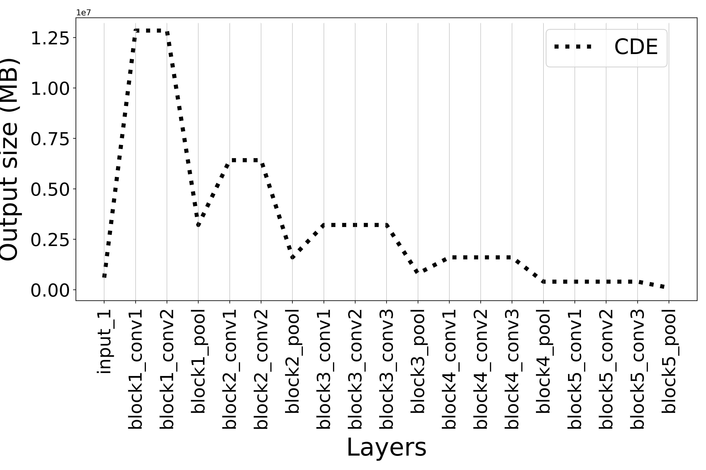

# I-Split: Deep Network Interpretability for Split Computing #

The official PyTorch implementation discussed in *I-Split: Deep Network Interpretability for Split Computing* paper.
Accepted at the 26TH International Conference on Pattern Recognition 2022 (ICPR2022).

## Abstract ##
This work makes a substantial step in the field of split computing, *i.e.*, how to split a deep neural network to host its early part on an embedded device and the rest on a server. So far, potential split locations have been identified exploiting uniquely architectural aspects, *i.e.*, based on the layer sizes. Here we show that not only the architecture of the layers does matter, but the **importance** of the neurons contained therein too. It follows that a split should be applied right after a layer with a high density of important neurons, in order to preserve the information flowing until then. Upon this idea, we propose **Interpretable Split** (I-Split): a procedure that identifies the most suitable splitting points by providing a reliable prediction on how well this split will perform in terms of classification accuracy, **beforehand** of its effective implementation. As a further major contribution of I-Split, we show that the best choice for the splitting point on a multiclass categorization problem depends also on which specific classes the network has to deal with.

## Installation ##
1. Clone this repo, and we'll call the directory that you cloned as ${ISPLIT_ROOT}.
2. Install dependencies. We use Python >= 3.8 and PyTorch >= 1.7.0.
3. To use the code from sources in a clean way, it is preferable that you set up a conda enviroment, say:

    ```
    $ conda create -n isplit python=3.8
    $ conda activate isplit
    $ conda install pytorch==1.7.0 torchvision==0.8.0 cudatoolkit=11.3 -c pytorch
    $ pip install -r requirements.txt
    ```

## Results of I-Split ##
Candidate splitting points identified by CDE and the CUI curve of I-Split on the VGG16. The *star* markers show the extra points that our method is able to identify, and not identified by the CDE approach.
<p align="center">
  
  
</p>

## Citation ##
If you use **I-Split**, please, cite the following paper:
```
@inproceedings{cunico2022split,
  title={I-SPLIT: Deep Network Interpretability for Split Computing},
  author={Cunico, Federico and Capogrosso, Luigi and Setti, Francesco and Carra, Damiano and Fummi, Franco and Cristani, Marco},
  booktitle={2022 26th International Conference on Pattern Recognition (ICPR)},
  pages={2575--2581},
  year={2022},
  organization={IEEE}
}
```
